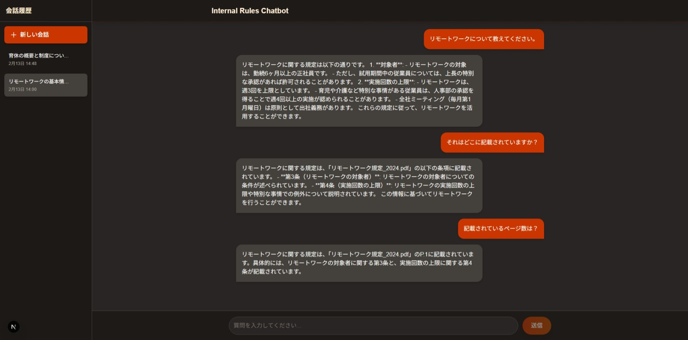

# Internal Rules Chatbot (RAG Practice)

RAG学習用に作成しました。
社内規定（PDF/テキストデータ）に基づき、従業員の質問に回答するAIチャットボットです。
RAG (Retrieval-Augmented Generation) 技術を使用し、正確な引用元を提示しながら回答します。



## ✨ 主な機能

- **RAG (検索拡張生成)**: Azure AI Search に保存された社内規定データを検索し、回答の根拠として使用します。
- **文脈理解 (Context Aware)**: 会話履歴を考慮し、「それはどういう意味？」のような指示語を含む質問も正しく解釈して検索します。
- **ストリーミング応答**: ChatGPTのように、回答を一文字ずつリアルタイムに表示します。
- **引用元の提示**: 回答に使用した情報の出典（ファイル名・ページ番号）を明記します。

## 🛠 技術スタック

- **言語**: Python 3.14+ / TypeScript (Node.js)
- **Frontend**: Next.js (App Router), Tailwind CSS
- **Backend**: FastAPI (Python)
- **Vector DB**: Azure AI Search
- **LLM**: OpenAI GPT-4o-mini
- **Embedding**: text-embedding-3-small

## 📂 プロジェクト構成

```
rag-practice/
├── backend/          # API Server (FastAPI)
│   ├── main.py       # Entrypoint
│   ├── uplaod_handbook.py # データ登録スクリプト
│   └── .env          # API Keys (OpenAI, Azure)
└── frontend/         # Chat UI (Next.js)
    └── app/          # React Components
```

## 🚀 環境構築 (Setup)

### 1. 依存関係のインストール

ルートディレクトリで以下のコマンドを実行するだけで、Frontend/Backend両方の準備が完了します（`pnpm` が必要です）。

```bash
pnpm install
```

### 2. 環境変数の設定

`backend/.env` ファイルを作成し、以下のキーを設定してください。

```ini
OPENAI_API_KEY=sk-...
AZURE_SEARCH_d_ENDPOINT=https://...
AZURE_SEARCH_ADMIN_KEY=...
```

### 3. テストデータの投入

Azure AI Search に社内規定データを登録します。

```bash
cd backend
# 仮想環境があれば activate してから
python upload_handbook.py
```

## ▶️ 実行方法 (Usage)

プロジェクトルートから以下のコマンドを実行すると、FrontendとBackendが同時に起動します。

```bash
pnpm dev
```

- **Chat UI**: http://localhost:3000
- **API Docs**: http://localhost:8000/docs
